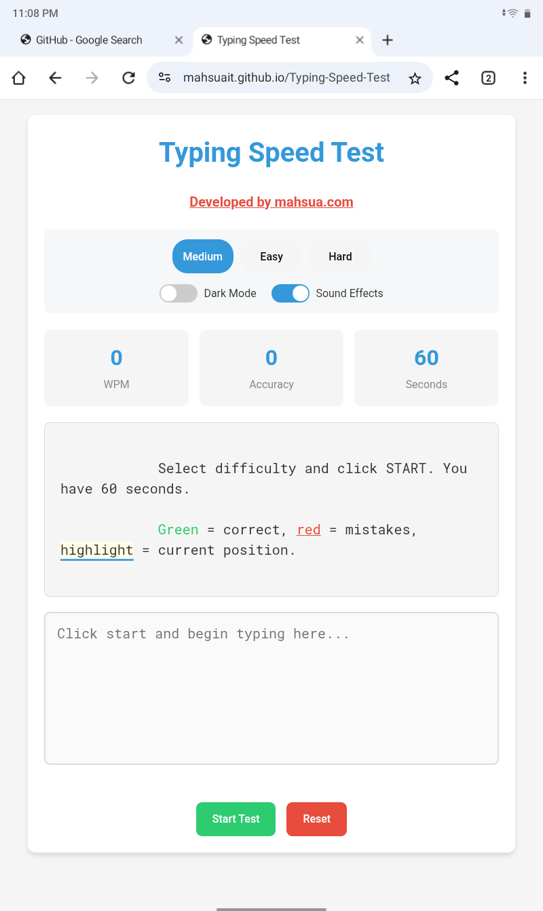

# Typing-Speed-Test

[](https://mahsuait.github.io/Typing-Speed-Test/))





A responsive web application to test and improve your typing speed with real-time statistics and visual feedback.

## Features

- 🎯 Multiple difficulty levels (Easy, Medium, Hard)
- ⏱ 60-second timed tests
- 📊 Real-time metrics (WPM, Accuracy)
- 🎨 Dark/Light mode toggle
- 🔊 Sound effects toggle
- ✅ Visual typing feedback
- 💾 Persistent settings
- 📱 Fully responsive design

## Technologies Used

- HTML5
- CSS3
- JavaScript
- Google Fonts

## Installation

```bash
git clone https://github.com/your-username/typing-speed-test.git
cd typing-speed-test
```

## File Structure

```bash
typing-speed-test/
├── index.html
├── styles.css
├── script.js
└── README.md
```
